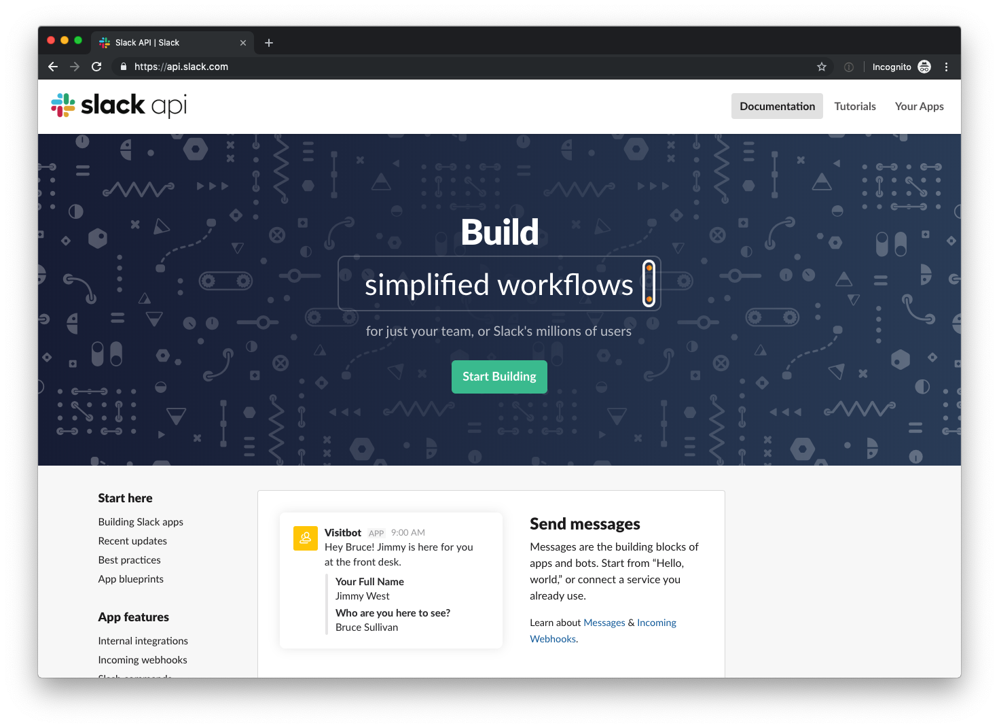
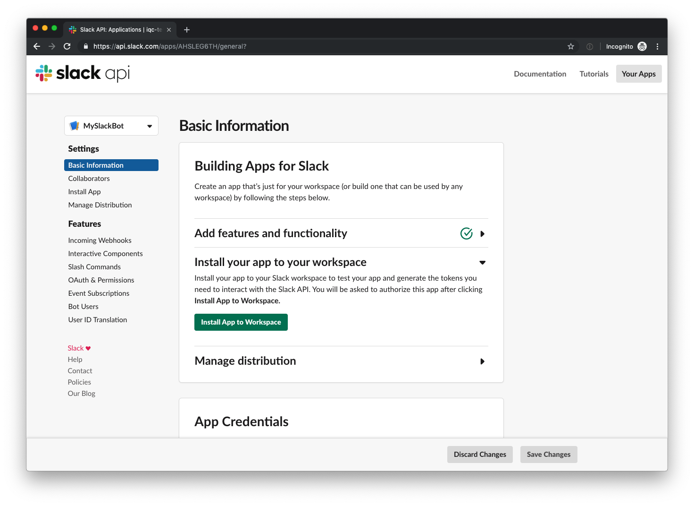

# Create Slack app

To be able to connect to a Slack server you need to create a new Slack
application for a workspace you have the appropreate rights to. This can be made
from [api.slack.com](https://api.slack.com) by signing in as yourself.

Even though we're build a bot we needto create a new application. An application
can be used as a webhook, event subscriber, slash command, bot or other things
as well. From this point on we will focus on creating a bot wich will be like a
human connection to a Slack channel and will read all messages and events like a
norma human would, including things like "User X is typing..." notifications.

To create a new application, click "Create an App"

Give the application a descriptive name (probably not "MySlackBot"...) and
select to which workspace it should be connected.

When you've created your app you should see it listed under "Your Apps" where
you can also see to which workspace it's connected.

If you click on your application in the list you'll end up in the "Basic
Information" view which gives you an overview of your application.

To create a bot user for this application which is what we need, click the "Bot
User" link in the left side menu.

Click "Add a Bot User" and give it a name.

You will also need to install this application to your worksapce which is done
under the "Basic Information" page by expanding "Install your app to your
workspace".

You'll need to authorize the application to connect to the workspace.

When this is done you'll notice that you now have access to two different kind
of OAuth tokens to use to authorize the application in the future. One of them
is named "Bot User OAuth Access Token" which is the one we'll need. **Note that
this should be seen as a password and will give anyone with access to it full
access to your worksapce!**

We're now ready to write some code which will use this token to connect as the
application user created to our worksapce!
