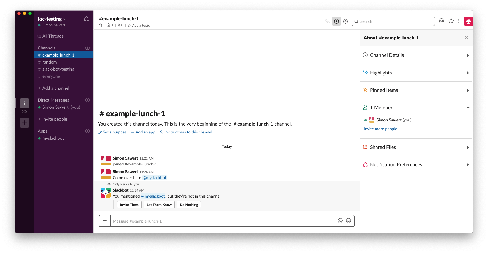
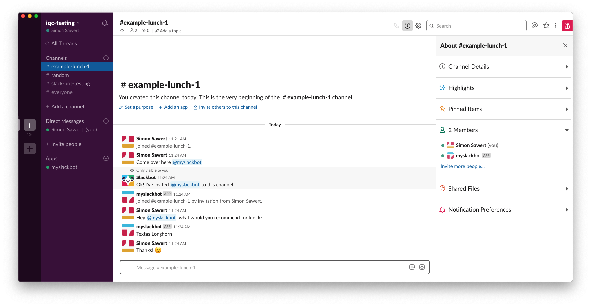

# Making the bot talk

Ok so now it's time to actually make this bot talk. We do this by starting to
look at all the incoming messages and check for things relevant to us.

One thing we may want to do first of all is to introduce the concept of
iterators. We will create an iterator to move the logic out of our way, to allow
single request items and to see each message as a list of things we're
interested in. This is made by creating a function that will return the data if
the bot was mentioned.

```python
def tagged_messages(client: SlackClient, user_id: str):
    """
    Check the connection and parse all events. If the event is of desired type
    or content yield the message to the consumer of the iterator.
    """
    while True:
        for data in client.rtm_read():
            if data.get("type") == "message" and user_id in data.get("text"):
                yield data

        time.sleep(1)
```

Now we just convert our code to use this iterator.

```python
    for data in tagged_messages(client, bot_id):
        client.rtm_send_message(
            data.get("channel"), "Wow, thanks for mentioning me!"
        )
```

This means that every time someone is mentioning the bot it will respond with
the text "Wow, thanks for mentioning me!". It's now time to filter out things
and interact with people if they use certain keywords.

## Lunch bot

Let's make the bot randomly chose what to eat for lunch from a list of
pre-defined alternatives. The trigger for this would be if someone mention the
bot and in the same sentence uses the keywords `lunch`, `eat` or `hungry`.

To check if a string occurs within another string you could use the `or` keyword
or operator.

```python
message = "This is a message with the word lunch"

if "lunch" in message  or "eat" in message or "hungry" in message:
    print("One of the words was found!")
```

However, a more common and pythonic way would probably be to use either a list
operator.

```python
message = "This is a message with the word lunch"

if any(x in message for x in ["lunch", "eat", "hungry"]):
    print("One of the words was found!")
```

So now we can just call a method that would respond if a keyword was used!

```python
def main():
    ...

    for data in tagged_messages(client, bot_id):
        if any(x in data.get("text") for x in ["lunch", "eat", "hungry"]):
            whats_for_lunch(client, data)
            continue


def whats_for_lunch(client: SlackClient, data: dict):
    """
    Fetch a random value of what's for lunch!
    """
    restaurants = ["Textas Longhorn", "Sushi!", "I think pizza!"]
    random_restaurant = random.choice(restaurants)

    client.rtm_send_message(data.get("channel"), random_restaurant)
```

Let's fix all our import, format our code and we now have, including comments
and documentation, a bot to help us chose lunch place with ~65 lines of code.

```python
#!/usr/bin/env python3
"""
Slack bot using the Slack API and python SlackClient
"""

import random
import os
import time
import sys

from slackclient import SlackClient

ACCESS_TOKEN = os.environ.get("SLACK_API_TOKEN")
RTM_READ_DELAY = 1  # 1 second delay between reading from RTM


def main():
    """
    main is the main program that will run when the script is executed.
    """
    client = SlackClient(ACCESS_TOKEN)

    if not client.rtm_connect(with_team_state=False):
        print("could not connect to slack")
        sys.exit(1)

    print("connected to network!")

    bot_id = client.api_call("auth.test")["user_id"]

    for data in tagged_messages(client, bot_id):
        if any(x in data.get("text") for x in ["lunch", "eat", "hungry"]):
            whats_for_lunch(client, data)
            continue


def tagged_messages(client: SlackClient, user_id: str):
    """
    Check the connection and parse all events. If the event is of desired type
    or content yield the message to the consumer of the iterator.
    """
    while True:
        for data in client.rtm_read():
            if data.get("type") == "message" and user_id in data.get("text"):
                yield data

        time.sleep(RTM_READ_DELAY)


def whats_for_lunch(client: SlackClient, data: dict):
    """
    Fetch a random value of what's for lunch!
    """
    restaurants = ["Textas Longhorn", "Sushi!", "I think pizza!"]
    random_restaurant = random.choice(restaurants)

    client.rtm_send_message(data.get("channel"), random_restaurant)


if __name__ == "__main__":
    main()
```

We may now start our bot and try it out!

```
$ SLACK_API_TOKEN=xoxb-... my-slackbot.py
connected to network!
```

This will make the bot come online, but we need to invite it to our channel.
This can be done by just mentioning the bot which will make a button appear
where you can click to invite it.


And this is what happens if we write something containing our keywords and also
mentioning the bot.


