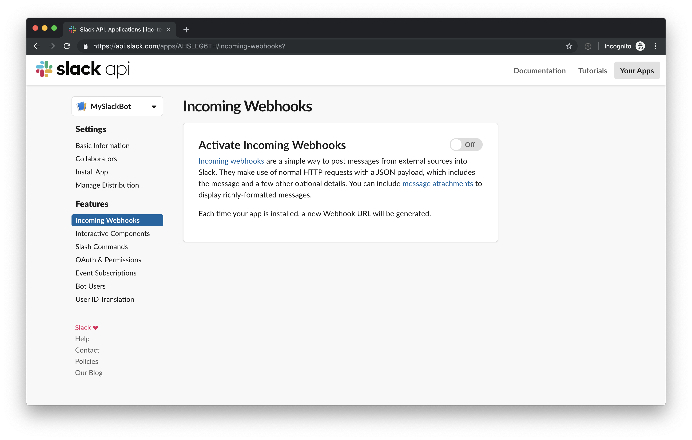
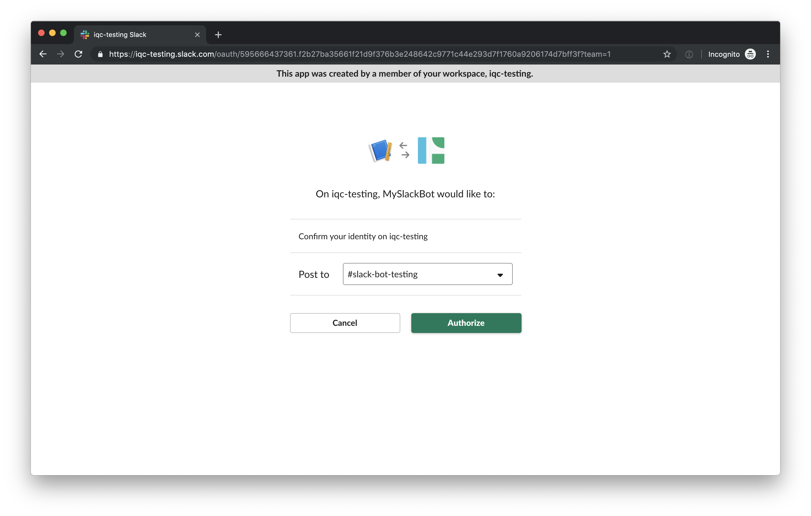
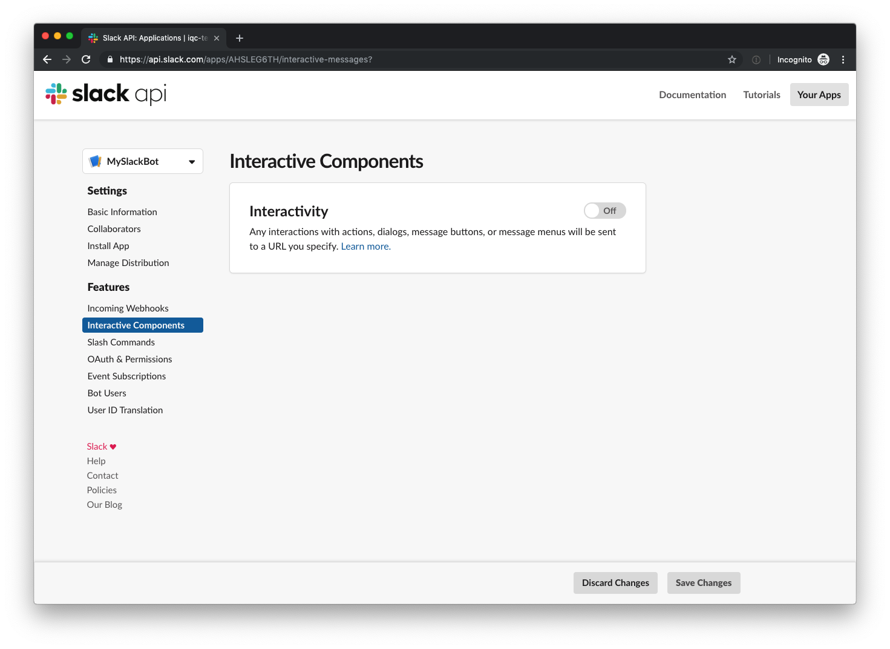

# Extend bot usages

So one could say that we're interactig with the bot and generally we would go
from here by implementing new commands in our code. We could add new keywords
which would make us be able to trigger new actions and so on. But before we go
in that direction I would like to show off some Slack specific features. While
doing so we will also try out one of the most famous Python frameworks;
[Flask](http://flask.pocoo.org/)!

But first, let's setup all prerequisites and configuration to support webhooks
and interactive components.

## Enabling Webhooks

So until now we've been using a bot user which is more like simulating a human
being with it's own Slack client. This can be noted by the fact that we don't
have any app icon for the bot user and that everything written by the bot user
uses the username and display name we chose while creating our bot user.

To support more advanced content where we can make Slack integrate with our code
and not just the other way around we must enable webhooks for our applicaiton.
According to [Wikipedia](https://en.wikipedia.org/wiki/Webhook), a webhook is
*"a method of augmenting or altering the behaviour of a web page, or web
application, with custom callbacks"*.

Start by enabling webhooks in the Slack dashboard.

When activated, a banner telling you to re-install the application will appear.

Click the link and re-install by authorizing the application again.

## Interactive Components

So, generaly to use a webhook you obviously need somewhere for an application to
send it's data. This is probably a webserver you already have and pay for which
is already configured... Or, maybe that's not the case? Enter
[ngrok](https://ngrok.com/)! Ngrok is an awesome tool shipped in a pre-compiled
binary which will create a reverse-proxy by setting up an SSH tunnel to a public
exposed URL. This is obviously not something to use in production but for now
this is great for us to test our development!

Click "Get started for free" and create and account or sign in with OAuth 2,
i.e. with your GitHub account. Just follow the instructions on screen.

And just like the documentation says, start ngrok with something like `ngrok
http 5000`.

We can now use the URL we got to enable "Interactive Components" in our Slack
settings.

And enter the URL we got from ngrok. Just to support separations of domains, for
now we'll add a trailing `/slackbot` path, so that means something like
`https://abc12345.ngrok.io/slackbot` where the screenshot says
`my.slack.endpoint.se`.

