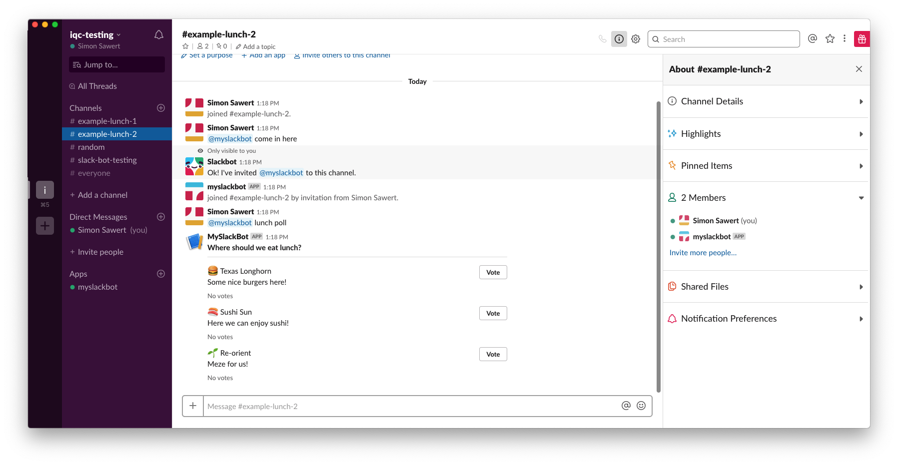

# Create chat message blocks

Alright so now we've enabled the bot to use webhooks and interactive components.
We've also created a reverse-proxy to handle all our incoming requests. But
before we do that, let's try to create a more detailed message which contains
other things than just text!

## Block kit

Slack has a very nice and well documented feature called [Block
Kit](https://api.slack.com/block-kit) which is a framework to build nice looking
messages right in slack. You've probably seen similar things like this if you've
ever seen a bot posting things like polls, Jira integrations, URL lookups
etcetera. By using the [Block kit
builder](https://api.slack.com/tools/block-kit-builder) we can quickly construct
a boilerplate of what we want to post with a great preview.

We probably don't want to be just as repetitive though so let's create a list of
restaurants with a description. We use a dictionary to describe the restaurant
since that makes it easier to extend in the future even though we technically
could just add the description as the dictionary value.

```python
restaurants = {
    ":hamburger: Texas Longhorn": {
        "description": "Some nice burgers here!"
    },
    ":sushi: Sushi Sun": {"description": "Here we can enjoy sushi!"},
    ":seedling: Re-orient": {"description": "Meze for us!"},
}
```

We can now create the header of the block with the title and a divider.

```python
blocks = [
    {
        "type": "section",
        "text": {"type": "mrkdwn", "text": "*Where should we eat lunch?*"},
    },
    {"type": "divider"},
]
```

And then iterate over all our restaurants and add them as individual items to
the block list, including a vote button and a divider.

```python
for restaurant, info in restaurants.items():
    blocks.extend(
        [
            {
                "type": "section",
                "text": {
                    "type": "mrkdwn",
                    "text": "{}\n{}".format(
                        restaurant, info.get("description")
                    ),
                },
                "accessory": {
                    "type": "button",
                    "text": {
                        "type": "plain_text",
                        "emoji": True,
                        "text": "Vote",
                    },
                    "value": "click_me_123",
                },
            },
            {
                "type": "context",
                "elements": [{"type": "mrkdwn", "text": "No votes"}],
            },
        ]
    )
```

## Post the message

So when we've done this we can use the slack client/API to post the block data
instead of plaintext. Remember the `client.rtm_send_message()`. We skip that and
do a raw call with `client.api_call()`. By doing so we can use all the features
as defined in the [Slack documentation](https://api.slack.com/methods) as is!

```python
client.api_call(
    "chat.postMessage", channel="my-channel-id", blocks=blocks
)
```

This will produce the following output:


