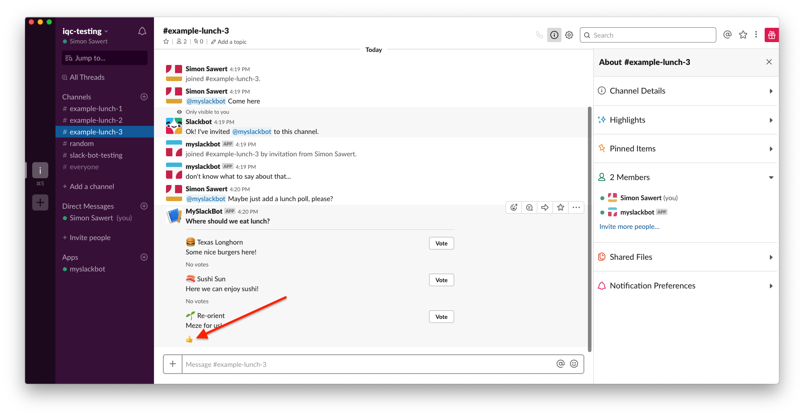

# Interact with messages

So even though we added buttons to the message by just following the guide and
block builder not much is happening when we press them. The reason we configured
the bot in the previous steps and setup a webhook request URL was to be able to
change that!

## Creating a web service

Python has many libraries and frameworks to work with the web and one really
popular which makes it super easy to get up and running is called
[Flask](http://flask.pocoo.org/). One of the great benefits with Flask is that
it's super easy to get up and running.

From the example on their web page, all you ned to do to host a server
responding a "Hello world" message is this.

```python
from flask import Flask
app = Flask(__name__)

@app.route("/")
def hello():
    return "Hello World!"
```

So, since we chose to add a slash (`/slackbot`) when we setup our request URL,
we can create a route which will get a request every time someone clicks a
button from a message created from our bot. Since the Slack API uses HTTP POST
[according to the
documentation](https://api.slack.com/messaging/interactivity/enabling) we must
tell the Flask application to listen for POST requests. We also know that Slack
posts the data as form data in a form named `payload`. The data within that form
should be valid JSON and thus we can extract the data and deserialize it into a
variable. We do this all at once like this.

```python
@app.route("/slackbot", methods=["POST"])
def slackbot():
    """
    HTTP endpoint handling slack integrations
    """
    payload = json.loads(request.form["payload"])

    return "OK", 200
```

And now it's just for us to start the Flask server on the port we told ngrok to
tunnel and we should be able to get the request from Slack. We start the server
like this.

```sh
$ SLACK_API_TOKEN=xoxb-xxx FLASK_APP=webhook/webhook.py flask run
 * Serving Flask app "webhook/webhook.py"
 * Environment: production
   WARNING: Do not use the development server in a production environment.
   Use a production WSGI server instead.
 * Debug mode: off
 * Running on http://127.0.0.1:5000/ (Press CTRL+C to quit)
```

If I were to add `print("{} clicked a button".format(payload.get("user",
{}).get("name")))` before my return statement, every time I were to click a
button from the Slack message the log would print `simon.sawert clicked a
button`.

## Updating the existing message

The goal here is to not post new messages when someone votes for an alternative
but instead update the existing message. Luckily this is not a problem according
to the [documentation](https://api.slack.com/methods/chat.update).

So after we've read and understand the payload we get we can figure out that we
need four variables to work with to add a vote.

* The button which was clicked
* The message timestamp (used as ID to update message)
* The channel it was posted in
* All the blocks in teh current message

Since these are all placed in different areas inside dictionaries and arrays we
wrap the whole extraction inside a `try/catch` bock where we try to access all
the fields and if we get a `KeyError` (field not found in dictionary) or
`IndexError` (we tried to reach an array element that doesn't exist) we just
assume it's a bad request.

```python
try:
    button_clicked = payload["actions"][0]["block_id"]
    message_ts = payload["container"]["message_ts"]
    channel_id = payload["channel"]["id"]
    blocks = payload["message"]["blocks"]
except (KeyError, IndexError):
    # We're missing either a key or index in list.
    return "Bad request", 400
```

So now we need to loop over the existing message and find the vote list to
update. We know that we should update the block found in the index after the
button that we clicked so we just loop over all blocks in the list and if it's
not the block we clicked we just check the next. We do this with a guad or early
return. This is to reduce indentation and complex logic.

```python
for i, block in enumerate(blocks):
    if block.get("block_id") != button_clicked:
        continue
```

If we get past this step we know we found the block clicked. We then try to
access the next block (vote list) and it's text. Again, we do this with a
`try/catch`.

```python
    try:
        next_block = blocks[i + 1]
        next_block_text = next_block["elements"][0].get("text")
    except (KeyError, IndexError):
        return "Bad request", 400
```

So again, if we get past this step, we know know what block to update. So all we
want to do now is to check if there are any existing votes. If not, reset the
field and add a new 👍.

```python
    # If there's not thumbsup yet, this is the first vote.
    if ":thumbsup:" not in next_block_text:
        next_block_text = ""

    next_block_text += ":thumbsup:"
    next_block["elements"][0]["text"] = next_block_text

    break
```

Since we know each button is only mapped to one vote row we may now break out of
the loop. All that's left to do is to update the message according to the API
documentation and reutrn a successful respons.

```python
client.api_call(
    "chat.update",
    channel=channel_id,
    ts=message_ts,
    blocks=payload.get("message").get("blocks"),
)

return "OK", 200
```

If we put all this toghether we now have a program that looks like this.

```python
#!/usr/bin/env python3
"""
This is a webhook integration for Slack bots. The interactive component
configuration points to this server.
"""

import os
import json

from flask import Flask, request
from slackclient import SlackClient

app = Flask(__name__)
client = SlackClient(os.environ.get("SLACK_API_TOKEN"))


@app.route("/slackbot", methods=["POST"])
def slackbot():
    """
    HTTP endpoint handling slack integrations
    """
    payload = json.loads(request.form["payload"])

    try:
        button_clicked = payload["actions"][0]["block_id"]
        message_ts = payload["container"]["message_ts"]
        channel_id = payload["channel"]["id"]
        blocks = payload["message"]["blocks"]
    except (KeyError, IndexError):
        # We're missing either a key or index in list.
        return "Bad request", 400

    for i, block in enumerate(blocks):
        if block.get("block_id") != button_clicked:
            continue

        try:
            next_block = blocks[i + 1]
            next_block_text = next_block["elements"][0].get("text")
        except (KeyError, IndexError):
            return "Bad request", 400

        # If there's not thumbsup yet, this is the first vote.
        if ":thumbsup:" not in next_block_text:
            next_block_text = ""

        next_block_text += ":thumbsup:"
        next_block["elements"][0]["text"] = next_block_text

        break

    client.api_call(
        "chat.update",
        channel=channel_id,
        ts=message_ts,
        blocks=payload.get("message").get("blocks"),
    )

    return "OK", 200
```

If we start our bot that will add the message with the vote buttons and also
start our Flask script which will listen to web hooks we can now see that if we
click the vote button a new thumb will appear.


