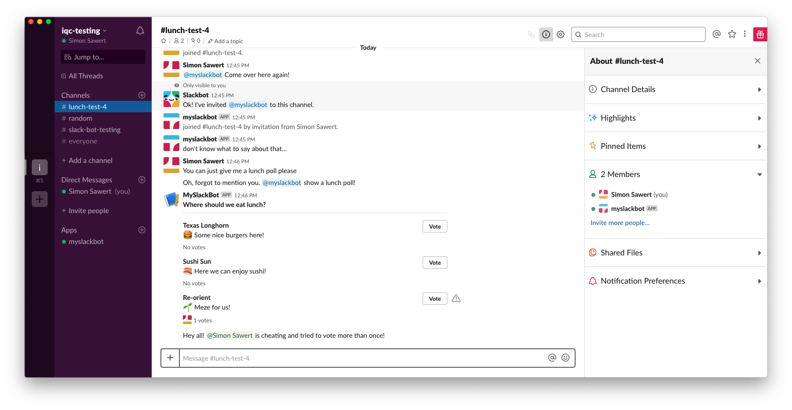

# Keep track of users

By now we're able to create messages, let users in the slack channel interact
with the messages and update the message according to the action. This is still
pretty anonymous though. We don't know who voted and thus we cannot limit the
number of votes. And if someone tries to cheat because they're super interested
in burgers today, they can't be stopped. So let's fix that!

## Only vote once

So we need to keep some kind of list in memory of the users who voted for a
given message. A message in this context means all available alternatives. We
can do this the easy way and just define a global variable within our Flask app.

```python
votes = {}
```

So let's start by adding yet another field to get from the incoming request,
the user ID. This is so we're sure we're limiting votes to unique users and not
usernames which may overlap. We just need to add this in the first `try` block.

```python
user_id = payload["user"]["id"]
```

And when we're done updating the message block that should change, we just add a
reference to the message in question and the user who voted. So let's start by
checking if the message is in memory at all. If not, we must add it so we can
insert our user.

```python
if message_ts not in votes:
    votes[message_ts] = {}

votes[message_ts][user_id] = True
```

So with these few lines we make sure that each time a user votes the user and
message will be kept in memory. So now we just need to stop the user from voting
multiple times. Let's add a guard just before we start checking the blocks
because this is where we've extracted the user ID.

```python
if votes.get(message_ts, {}).get(user_id, False):
    client.api_call(
        "chat.postMessage",
        channel=channel_id,
        text="Hey all! <@{}> is cheating and tried to vote more than once!".format(
            user_id
        ),
    )

    return "Forbidden", 403
```

If the message has been seen and the user has voted, let's call the user out so
everyone knows what's going on! Also, if we return an HTTP status within the 400
range the Slack client will show a ⚠️  to the user trying to cheat.

## Who voted

So now that we have the user ID, maybe we should just use that information to
show for votes instead of an emoji. Every user on Slack has an avatar so let's
use that and show the full name if we hover over it. It may also be a good idea
to show the total number of votes.

We start by using the Slack API yet again and this time we use the
[users.info](https://api.slack.com/methods/users.info) method. This endpoint
gives us all the information we need such as avatar URL and full name. Let's do
this (if the user hasn't voted yet).

```python
user_data = client.api_call("users.info", user=user_id)

user_info = {
    "type": "image",
    "image_url": user_data["user"]["profile"]["image_48"],
    "alt_text": user_data["user"]["profile"]["display_name"],
}
```

The reason we store the user info that way is because it's conforming to the
Slack API regarding how to add an image in a context block. So all we need to do
when we found the block to update is to replace the string concatenation (`+=
":thumbsup:"`) with this block. We make sure to `insert()` the picture so we can
tell what order people voted and always have the vote counter last.

```python
# Insert the user who voted.
next_block["elements"].insert(0, user_info)

# Update the number of votes.
next_block["elements"][-1]["text"] = "{} votes".format(
    len(next_block["elements"]) - 1
)
```

So now when I vote my image will show up and if I vote multiple times I'll get
called out.



Everything put together right now looks like this.

```python
#!/usr/bin/env python3
"""
This is a webhook integration for Slack bots. The interactive component
configuration points to this server.
"""

import os
import json

from flask import Flask, request
from slackclient import SlackClient

app = Flask(__name__)
client = SlackClient(os.environ.get("SLACK_API_TOKEN"))
votes = {}


@app.route("/slackbot", methods=["POST"])
def slackbot():
    """
    HTTP endpoint handling slack integrations
    """
    payload = json.loads(request.form["payload"])

    try:
        user_id = payload["user"]["id"]
        button_clicked = payload["actions"][0]["block_id"]
        message_ts = payload["container"]["message_ts"]
        channel_id = payload["channel"]["id"]
        blocks = payload["message"]["blocks"]
    except (KeyError, IndexError):
        # We're missing either a key or index in list.
        return "Bad request", 400

    # User has already voted! By returning a 4xx status code the user will se a
    # ⚠ in their Slack client.
    if votes.get(message_ts, {}).get(user_id, False):
        client.api_call(
            "chat.postMessage",
            channel=channel_id,
            text="Hey all! <@{}> is cheating and tried to vote more than once!".format(
                user_id
            ),
        )

        return "Forbidden", 403

    user_data = client.api_call("users.info", user=user_id)

    user_info = {
        "type": "image",
        "image_url": user_data["user"]["profile"]["image_48"],
        "alt_text": user_data["user"]["profile"]["display_name"],
    }

    for i, block in enumerate(blocks):
        if block.get("block_id") != button_clicked:
            continue

        try:
            next_block = blocks[i + 1]
        except (KeyError, IndexError):
            return "Bad request", 400

        # Insert the user who voted.
        next_block["elements"].insert(0, user_info)

        # Update the number of votes.
        next_block["elements"][-1]["text"] = "{} votes".format(
            len(next_block["elements"]) - 1
        )

        break

    blocks = clean_blocks(blocks)

    # Store that the user has voted on this specific message.
    if message_ts not in votes:
        votes[message_ts] = {}

    votes[message_ts][user_id] = True

    client.api_call(
        "chat.update", channel=channel_id, ts=message_ts, blocks=blocks
    )

    return "OK", 200


def clean_blocks(blocks):
    """
    The message that comes from the action button from Slack has added
    additional information for the context blocks which does not conform with
    the API documentation. To be able to post the message back to Slack we must
    clean all fields that's not allowed.
    """
    for block in blocks:
        for i, element in enumerate(block.get("elements", [])):
            if element["type"] != "image":
                continue

            block["elements"][i] = {
                "type": element["type"],
                "image_url": element["image_url"],
                "alt_text": element["alt_text"],
            }

    return blocks


if __name__ == "__main__":
    app.run()
```

The last part about `if __name__ ...` is nothing to care about. The only reason
is because `flask run` doesn't work with filenames in the format I wanted to use
for this project. By doing this we can start the application by running the
script rather than `flask run`. This means something like this.

```sh
$ SLACK_API_TOKEN=xoxb-xxxx webhook/01.webhook.py
 * Serving Flask app "01.webhook" (lazy loading)
 * Environment: production
   WARNING: Do not use the development server in a production environment.
   Use a production WSGI server instead.
 * Debug mode: off
 * Running on http://127.0.0.1:5000/ (Press CTRL+C to quit)
```
